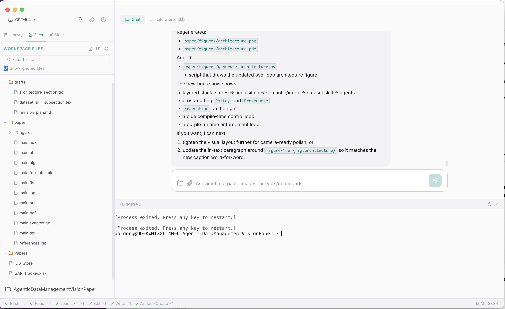
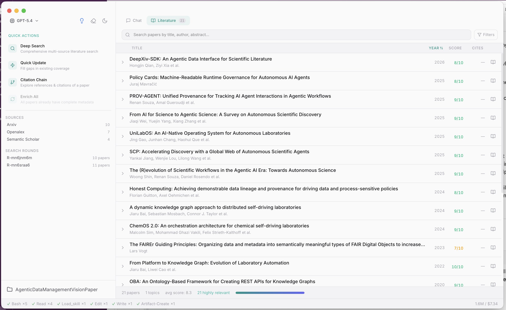

# Research Copilot

An AI-powered desktop research assistant for scientists and academics. Literature search, data analysis, academic writing, and project management — all in one place.

Built on [pi-mono](https://github.com/badlogic/pi-mono) (agent runtime) + Electron + React.



---

## API Keys Setup (READ THIS FIRST)

Research Copilot requires API keys to function. Add them to your shell profile (`~/.zshrc`, `~/.bashrc`, etc.):

```bash
# ===== REQUIRED (at least one) =====
export OPENAI_API_KEY="sk-..."           # For OpenAI models (GPT-4o, GPT-5, o3, etc.)
export ANTHROPIC_API_KEY="sk-ant-..."    # For Anthropic models (Claude Sonnet, Opus, etc.)

# ===== RECOMMENDED =====
export BRAVE_API_KEY="BSA..."            # For web search (https://brave.com/search/api/)
export OPENROUTER_API_KEY="sk-or-..."    # For AI-generated scientific diagrams (https://openrouter.ai/)
```

Then reload your shell: `source ~/.zshrc`

### What happens without each key?

| Key | Required? | What it powers | Without it |
|-----|-----------|---------------|------------|
| `OPENAI_API_KEY` | **Yes** (if using OpenAI models) | Core AI agent — all chat, coding, writing, analysis | App cannot start the agent. You'll see an error dialog on first message. |
| `ANTHROPIC_API_KEY` | **Yes** (if using Anthropic models) | Core AI agent (same as above, for Claude models) | Same — agent won't initialize for Claude models. |
| `BRAVE_API_KEY` | Recommended | `web_search` tool — general web search via Brave Search | **Graceful fallback**: web search automatically degrades to arXiv-only (academic papers). No general web results. |
| `OPENROUTER_API_KEY` | Optional | `scientific-schematics` skill — AI-generated diagrams, flowcharts, graphical abstracts | The schematics skill fails when invoked. All other skills (writing, visualization, data analysis) work fine. |

> **Minimum viable setup**: You need **at least one** of `OPENAI_API_KEY` or `ANTHROPIC_API_KEY` to use the app. Everything else enhances the experience but is not strictly required.

> **Semantic Scholar, arXiv, OpenAlex, DBLP**: These academic APIs are used for literature search and **do not require API keys**. They work out of the box.

---

## Features

### AI Chat with Coding & Writing Tools
Converse with an AI research assistant that can read, write, and edit files in your workspace. It generates LaTeX manuscripts, creates publication-quality figures, runs Python analysis scripts, and manages your project files — all through natural language.

### Multi-Source Literature Search
Search across **Semantic Scholar**, **arXiv**, **OpenAlex**, and **DBLP** simultaneously. Papers are scored for relevance, deduplicated, and organized in a searchable table. Quick actions let you do deep searches, fill coverage gaps, or trace citation chains.



### Extensible Skills System
Skills are lazy-loaded knowledge modules that give the AI domain expertise. The app ships with 13 builtin skills covering academic writing (paper-writing, grant proposals, rewrite-humanize), visualization (matplotlib, scientific schematics), data analysis, and more. You can also add your own project-specific skills.

### File Attachments in Chat
Attach files directly in the chat input via the paperclip button, drag & drop, or paste. Supported formats:

| Format | How it's processed |
|--------|--------------------|
| **Images** (PNG, JPEG, GIF, WebP) | Sent as vision content — the LLM sees the image visually |
| **Text files** (CSV, MD, TXT, JSON, XML, HTML) | Read directly and injected as text into the message |
| **Documents** (PDF, DOCX) | Converted to text via `markitdown` CLI (with `pypdf` fallback for PDF), then injected into the message |

> **Note**: Document conversion requires `markitdown` (`pip install markitdown[all]`) or `pypdf` (`pip install pypdf`) for PDF/DOCX files. Text-based formats work out of the box with no extra dependencies.

> **Future plan**: The underlying Anthropic API supports native PDF document blocks (preserving layout, tables, and embedded images). Once the pi-mono agent runtime adds `DocumentContent` support, PDF attachments will be upgraded to use native API handling instead of text extraction.

### More
- **Document conversion** — PDF / DOCX / PPTX / XLSX → Markdown (via agent tools)
- **Python data analysis** — LLM-generated analysis with matplotlib/seaborn visualization
- **Artifact management** — notes, papers, data, web content with CRUD tools
- **@-mention system** — reference entities inline in chat
- **Session continuity** — automatic context compaction and session summaries
- **Integrated terminal** — run commands without leaving the app
- **LLM providers** — OpenAI and Anthropic models supported

## Prerequisites

- **Node.js** >= 18
- **npm** >= 9
- **Python 3** (optional, for data analysis and figure generation)
- **macOS** (Electron desktop app; Linux/Windows support is untested)

## Getting Started

```bash
# Clone the repository
git clone https://github.com/daidong/AgentFoundry.git
cd AgentFoundry

# Install dependencies
npm install

# Start in development mode
npm run dev
```

Make sure your API keys are configured (see [API Keys Setup](#api-keys-setup-read-this-first) above).

### Build for Production

```bash
# Build the Electron app
npm run build

# Package as macOS DMG
cd app
npm run pack
```

## Project Structure

```
app/                  # Electron desktop application
├── src/main/         # Main process (IPC handlers, app lifecycle)
├── src/preload/      # Context bridge (renderer ↔ main)
└── src/renderer/     # React UI (components, Zustand stores)

lib/                  # Research agent logic (framework-independent)
├── agents/           # Coordinator agent + prompt registry
├── commands/         # Artifact CRUD, search, enrichment
├── mentions/         # @-mention parsing and resolution
├── memory-v2/        # Artifact storage and session summaries
├── skills/           # Skills system (loader + builtin skills)
└── tools/            # Research tools (web, literature, data, convert)

shared-electron/      # Reusable Electron IPC utilities
shared-ui/            # Shared React components and stores
```

## Adding Custom Skills

Create a Markdown file at `<your-workspace>/.pi/skills/<name>/SKILL.md`:

```markdown
---
id: my-skill
name: My Skill
shortDescription: Brief description of what this skill does
---

Summary loaded at startup.

## Procedures
Detailed guidance loaded on demand when the skill is activated.
```

Skills are auto-discovered from three locations (later overrides earlier):
1. `lib/skills/builtin/` — shipped with the app
2. `~/.research-pilot/skills/` — user-global
3. `<workspace>/.pi/skills/` — project-specific

## Configuration

Research Copilot stores its data in the workspace under `.research-pilot/`:

```
.research-pilot/
├── artifacts/          # Notes, papers, data, web content
│   ├── notes/
│   ├── papers/
│   ├── data/
│   └── web-content/
└── memory-v2/
    └── session-summaries/
```

## License

[MIT](LICENSE)
