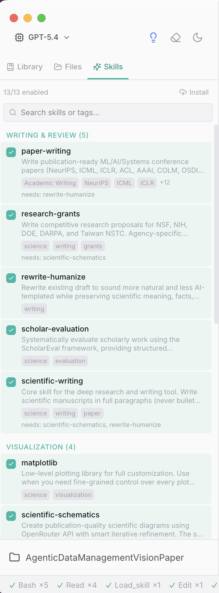

# Research Copilot

An AI-powered desktop research assistant for scientists and academics. Literature search, data analysis, academic writing, and project management — all in one place.

Built on [pi-mono](https://github.com/badlogic/pi-mono) (agent runtime) + Electron + React.


## Features

### AI Chat with Coding & Writing Tools
Converse with an AI research assistant that can read, write, and edit files in your workspace. It generates LaTeX manuscripts, creates publication-quality figures, runs Python analysis scripts, and manages your project files — all through natural language.

### Multi-Source Literature Search
Search across **Semantic Scholar**, **arXiv**, **OpenAlex**, and **DBLP** simultaneously. Papers are scored for relevance, deduplicated, and organized in a searchable table. Quick actions let you do deep searches, fill coverage gaps, or trace citation chains.


### Extensible Skills System
Skills are lazy-loaded knowledge modules that give the AI domain expertise. The app ships with 13 builtin skills covering academic writing (paper-writing, grant proposals, rewrite-humanize), visualization (matplotlib, scientific schematics), data analysis, and more. You can also add your own project-specific skills.



### More
- **Document conversion** — PDF / DOCX / PPTX / XLSX → Markdown
- **Python data analysis** — LLM-generated analysis with matplotlib/seaborn visualization
- **Artifact management** — notes, papers, data, web content with CRUD tools
- **@-mention system** — reference entities inline in chat
- **Session continuity** — automatic context compaction and session summaries
- **Integrated terminal** — run commands without leaving the app
- **20+ LLM providers** — OpenAI, Anthropic, OpenRouter, and more via pi-mono

## Prerequisites

- **Node.js** >= 18
- **npm** >= 9
- **Python 3** (optional, for data analysis and figure generation)
- **macOS** (Electron desktop app; Linux/Windows support is untested)

## Getting Started

```bash
# Clone the repository
git clone https://github.com/daidong/AgentFoundry.git
cd AgentFoundry

# Install dependencies
npm install

# Start in development mode
npm run dev
```

On first launch, you'll be prompted to configure your LLM provider (API key for OpenAI, Anthropic, OpenRouter, etc.).

### Build for Production

```bash
# Build the Electron app
npm run build

# Package as macOS DMG
cd app
npm run pack
```

## Project Structure

```
app/                  # Electron desktop application
├── src/main/         # Main process (IPC handlers, app lifecycle)
├── src/preload/      # Context bridge (renderer ↔ main)
└── src/renderer/     # React UI (components, Zustand stores)

lib/                  # Research agent logic (framework-independent)
├── agents/           # Coordinator agent + prompt registry
├── commands/         # Artifact CRUD, search, enrichment
├── mentions/         # @-mention parsing and resolution
├── memory-v2/        # Artifact storage and session summaries
├── skills/           # Skills system (loader + builtin skills)
└── tools/            # Research tools (web, literature, data, convert)

shared-electron/      # Reusable Electron IPC utilities
shared-ui/            # Shared React components and stores
```

## Adding Custom Skills

Create a Markdown file at `<your-workspace>/.pi/skills/<name>/SKILL.md`:

```markdown
---
id: my-skill
name: My Skill
shortDescription: Brief description of what this skill does
---

Summary loaded at startup.

## Procedures
Detailed guidance loaded on demand when the skill is activated.
```

Skills are auto-discovered from three locations (later overrides earlier):
1. `lib/skills/builtin/` — shipped with the app
2. `~/.research-pilot/skills/` — user-global
3. `<workspace>/.pi/skills/` — project-specific

## Configuration

Research Copilot stores its data in the workspace under `.research-pilot/`:

```
.research-pilot/
├── artifacts/          # Notes, papers, data, web content
│   ├── notes/
│   ├── papers/
│   ├── data/
│   └── web-content/
└── memory-v2/
    └── session-summaries/
```

## License

[MIT](LICENSE)
